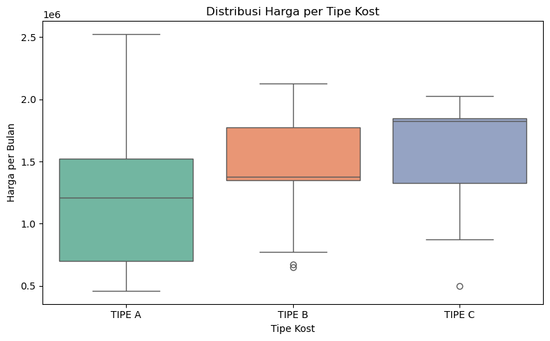
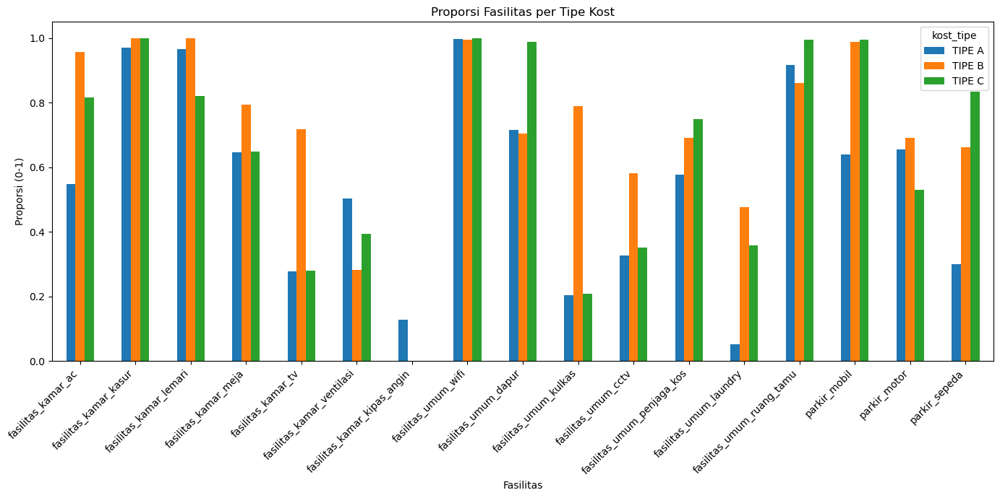

# Kost Data Analysis in Yogyakarta

<div align="center">


</div>

A data analysis project focused on boarding house (kost) listings in Yogyakarta. This project turns raw listing data into actionable business insights by cleaning the dataset, extracting amenity features, classifying room types, and identifying the best kost options based on price and facilities.

## Project Overview

This analysis aims to answer practical questions such as:

- What is the price range for each kost type?
- Which facilities are most commonly offered?
- Does parking, Wi-Fi, or bathroom type strongly influence rent?
- Which kost is the best recommendation within each room category?

The project is designed as an exploratory data analysis workflow rather than a machine learning pipeline, making it suitable for business and market understanding.

## Business Context

The rental market in Yogyakarta is highly price-sensitive and facility-driven. Students, workers, and tenants often compare several factors before choosing a kost, including:

- monthly rent
- room category / type
- bathroom availability
- AC, bed, wardrobe, table, and Wi-Fi access
- parking availability
- nearby university location

This project helps translate raw listing text into structured insights that can support decision-making for tenants and property owners.

## Data Cleaning and Preprocessing

The raw dataset was processed through a targeted cleaning pipeline:

- removed irrelevant columns
- detected room type from the property name when available
- filled missing `kost_tipe` values based on price patterns
- converted facility text into binary features like `ya` / `tidak`
- normalized missing text values into consistent labels
- exported a clean dataset for analysis

### Sample preprocessing logic

- `kost_tipe` inferred from room name and then refined by price range
- amenity fields converted into features such as:
  - `fasilitas_kamar_ac`
  - `fasilitas_kamar_kasur`
  - `fasilitas_umum_wifi`
  - `parkir_motor`
  - `ada_parkir`
- missing values were standardized so the dataset is analysis-ready

## Exploratory Data Analysis

The analysis focuses on understanding how pricing and facilities vary across room types. Key EDA questions include:

- average rent by room category
- distribution of room prices by type
- most common facilities offered by kosts
- relationship between availability of parking and monthly price
- patterns in amenities across different room types

## Key Findings

- Price increases as room type becomes more premium.
- Facilities such as AC, Wi-Fi, and bathroom access are strong differentiators.
- Parking availability is often associated with higher rental value.
- Best recommendations can be identified by balancing amenities and affordability.

## Dashboard & Visualizations

### Price Distribution by Kost Type



This chart shows how rent varies across room categories. It helps highlight the price gap between low-cost and premium room types.

### Facility Availability by Kost Type



This chart identifies which amenities are most common and how facility patterns differ between room categories.

## Recommendation Logic

To determine the best kost per type, a simple weighted score was created using:

- facility score
- affordability score
- overall value score combining both dimensions

This allows the project to highlight the strongest candidate for each type instead of just the cheapest or most luxurious option.

## Project Structure

```text
Project Kost Jogja/
├── kosts.csv
├── preprocessed_dataset.csv
├── Preprocessing.ipynb
├── output_distribusihargapertipe.png
├── output_fasilitas.png
├── README.md
└── LICENSE (optional)
```

## Tech Stack

- Python
- Pandas
- NumPy
- Matplotlib
- Seaborn
- Jupyter Notebook

## How to Run

1. Clone the repository.
2. Install the required dependencies:

```bash
pip install pandas numpy matplotlib seaborn jupyter
```

3. Open and run the notebook:

```bash
jupyter notebook Preprocessing.ipynb
```

## Impact

This project demonstrates a practical data analyst workflow for real-world housing data: cleaning messy listings, transforming text-based features into useful variables, and turning raw data into clear business insights and recommendations.

## Conclusion

This project provides a transparent and interpretable analysis of the Yogyakarta kost market. It is useful for understanding pricing patterns, facility trends, and the best-value options available in each room category.

---

If you want, I can also turn this into a more premium portfolio version with a stronger title, hero section, and a short “Business Insights” summary at the top.
